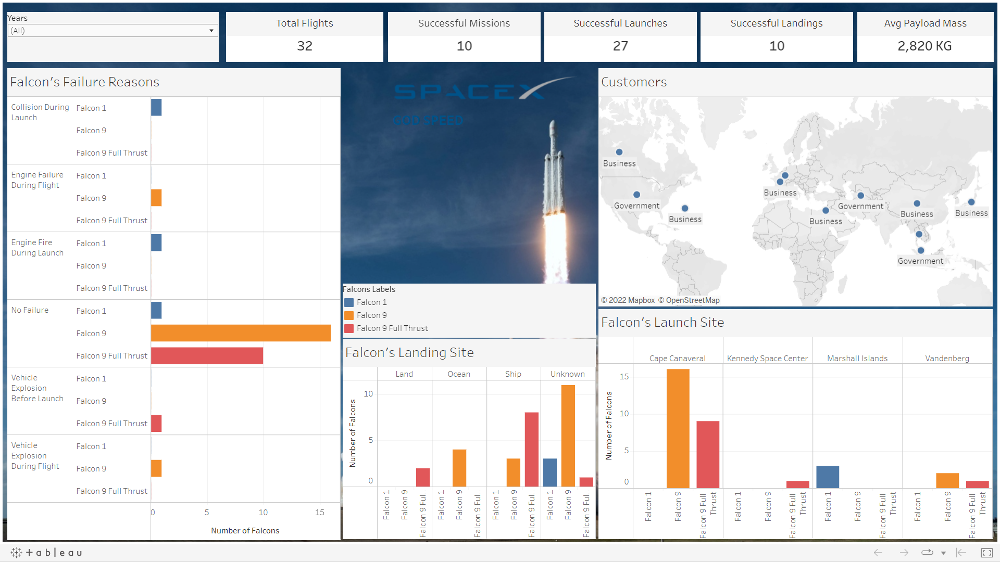

# SpaceX Analytics


Analysis of space missions for SpaceX company.

## Tech Stack


## Download

```bash
  git clone https://github.com/adionmission/SpaceX-Analytics.git
```

## About

The original work was done only using python and jupyter. No data cleaning was done and no logic was explained, like some attributes were named wrong and does not clarify the relation between mission outcome or launch outcome. Further, no proper visualization was shown.

The dataset contains total of 41 rows which is not that big, so for data insights, EXCEL was used instead of SQL. But cleaning data in the excel is not reliable at all and even more time consuming than SQL.

Too much of manual work you know.

Now here comes the role on R where you just need to define a function in a pipline.

## Data pipeline in R

```r
  data_clean = df %>%
    drop_na()
```

## About Dataset

The dataset is of SpaceX Missions. There were 2 dataset given by the acknowledgement in which both the data are same. But the second one, which is named as SpaceX-Missions.csv has more detailed information. 

The content of the dataset are as follows:

| Label           | Data Type                                                             |
| ----------------- | ------------------------------------------------------------------ |
| Flight Number | Character |
| Launch Date | Character |
| Launch Time | Character |
| Launch Site | Character |
| Vehicle Type | Character |
| Payload Name | Character |
| Payload Type | Character |
| Payload Mass (kg) | Numeric |
| Payload Orbit | Character |
| Customer Name | Character |
| Customer Type | Character |
| Customer Country | Character |
| Mission Outcome | Character |
| Failure Reason | Character |
| Landing Type | Character |
| Landing Outcome | Character |

Just for a kind information, I love SpaceX 😍. Thank you to acknowledgement for providing this dataset.


## Original Methodology

 - Data insights using Python.
 - Data cleaning using Python.
 - Data visualization using Python.

## My Methodology

 - Data insights using Excel.
 - Data cleaning using R programming.
 - Data visualization using Tableau.

## Data Cleaning

There were too many NA values in the dataset. All cannot be removed as it will remove the complete data from the data frame.

For the payload mass, it cannot be NA or 0. There is no such thing as 0 kg payload. So, the data in that row is useless.

First the double type was converted to int, then round off and finally the cells which have 0 as a value in the payload mass were removed.

```r
  data_clean$payload_mass_kg = as.numeric(data_clean$payload_mass_kg)
  data_clean$payload_mass_kg = round(data_clean$payload_mass_kg)
  data_clean$payload_mass_kg[is.na(data_clean$payload_mass_kg)] = 0
  data_clean = filter(data_clean, payload_mass_kg > 0)
```

Same was one with payload type, customer type, and customer country.

Deleting some column which are not needed for analysis.

```r
  data_clean = subset(data_clean, select = -c(customer_name,
                                            payload_name,
                                            payload_orbit,
                                            launch_time))

```

The given mission outcome column is renamed with launch outcome as it does not make sense.
If land outcome is failure, then how mission outcome be success.
For mission to be success, both launch and land should be success.
Also, as per logic if rocket never launched, then how will it land. So, if launch is failure, then land is also failure.

So, Converting success and failure in 1 and 0 for the total count of launch outcome and landing outcome.

```r
  data_clean$launch_outcome[data_clean$launch_outcome == "Success"] = 1
  data_clean$landing_outcome[data_clean$landing_outcome == "Success"] = 1
```

Also, in the landing type, the data where it is written None was converted into Unknown and NA values in it was also converted to unknown.

```r
  data_clean$landing_type[data_clean$landing_type == "None"] = "Unknown"
```

Removing brackets and number is the Character type - Vehicle Type and Launch Site.

```r
  data_clean$vehicle_type[data_clean$vehicle_type == "Falcon 9 (v1.0)"] = "Falcon 9"
  data_clean$launch_site[data_clean$launch_site == "Cape Canaveral AFS LC-40"] = "Cape Canaveral"
```

Also, renaming Flight number with integer values 1:total number of rows and NA with no failure in the failure reason column.

```r
  data_clean$failure_reason[is.na(data_clean$failure_reason)] = "No Failure"
  data_clean$flight_number = c(1:32)
```

In the payload type column - communication satellite, research satellite, and research satellites means the same when compared to given value communication/research satellite. So, converted these values with communication/research satellite. 

```r
  data_clean$payload_type[data_clean$payload_type == "Research Satellite"] = "Communication/Research Satellite"
```

## New Parameters

Made four new parameters that are 
 - Mission Outcome
 - Falcon 1
 - Falcon 9
 - Falcon 9 Full Thrust

For mission outcome, both the values in launch outcome and landing outcome should be 1 = success which make more logic. 0 in OR case or both as 0.

```r
  data_clean$payload_type[data_clean$payload_type == "Research Satellite"] = "Communication/Research Satellite"
  data_clean$mission_outcome[data_clean$launch_outcome == 0 & data_clean$landing_outcome == 1] = 0
```

Assigning numbers to falcons for graphical analysis as per falcon rockets

```r
  data_clean$falcon_1[data_clean$falcon_1 == "Falcon 1"] = 1
  data_clean$falcon_9[data_clean$falcon_9 == "Falcon 9"] = 1
  data_clean$falcon_9_full_thrust[data_clean$falcon_9_full_thrust == "Falcon 9 Full Thrust"] = 1
```

## Visualizations

The visualization were made using Tableau. The blue color in the CUSTOMER section does not mention Falcon 1. It's just a blue color. That's all.



## Disclaimer

If you are using this repository, acknowledging it is important.

## Acknowledgements

 - [Dataset](https://github.com/BriantOliveira/SpaceX-Dataset)
